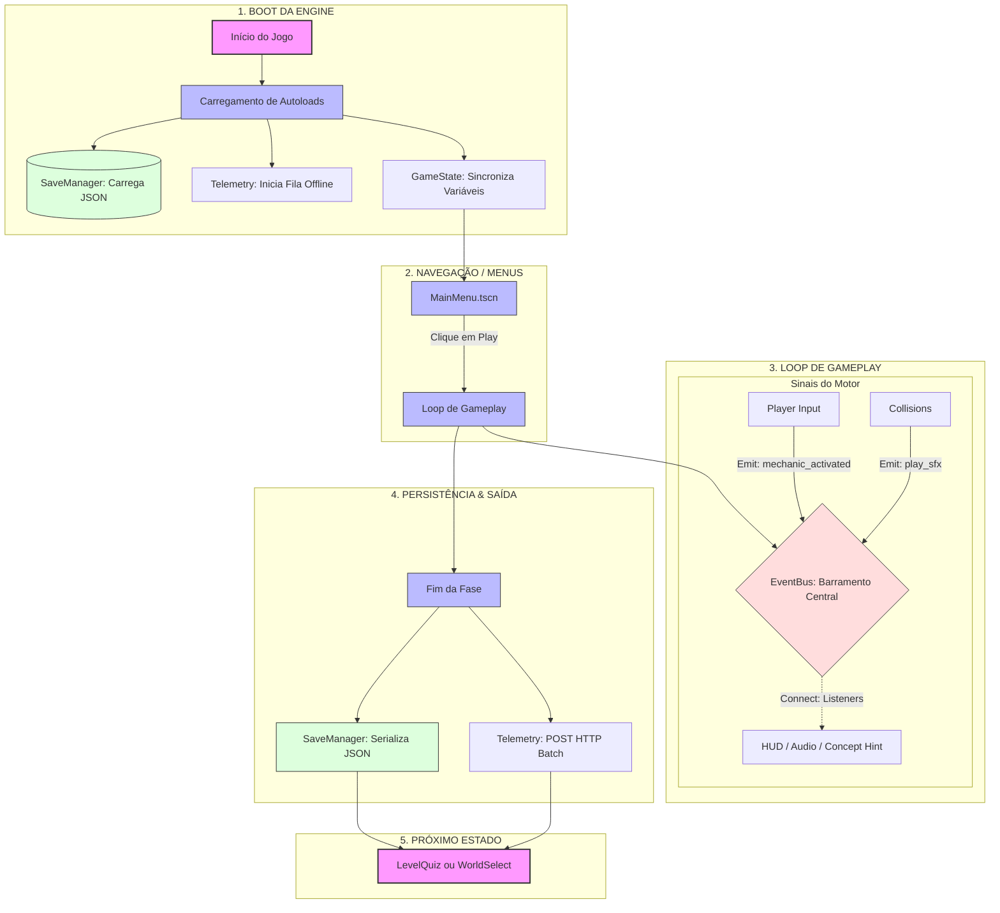

# 🏗️ Estrutura do Projeto

Esta seção detalha o fluxo holístico do CodeGame, mostrando como as diferentes peças da arquitetura se encaixam desde o boot inicial até a persistência de dados.

## Fluxograma Global de Funcionamento

O diagrama abaixo ilustra o ciclo de vida do motor e como os sistemas assíncronos (Telemetria) e síncronos (GameState) colaboram.

## Detalhes dos Bastidores

### O Papel do EventBus como "Middleware"
Quase nenhuma comunicação no jogo é direta (`A -> B`). O `EventBus` atua como um barramento onde o emissor não sabe quem é o receptor. Isso permite que possamos adicionar ou remover sistemas (como um novo logger ou sistema de conquistas) sem alterar o código do Player ou das Mecânicas.

### Persistência Silenciosa
O `SaveManager` e o `TelemetryManager` trabalham fora da percepção do jogador. Enquanto o `SaveManager` garante a integridade do progresso local (JSON), o `TelemetryManager` gerencia uma fila em memória que tenta se auto-sincronizar com o backend sempre que houver conexão, sem nunca travar a thread principal (non-blocking).

### Autoloads como Estado Persistente
Como o Godot limpa a árvore de nós ao trocar de cenas, os **Autoloads** (Singletons) são cruciais. Eles residem em uma raiz separada (`root`) que nunca é deletada, funcionando como uma memória viva que mantém o UUID do jogador e as estrelas coletadas enquanto ele viaja entre os mundos.

---
[⬅️ Voltar para o README.MD](../../README.md)
