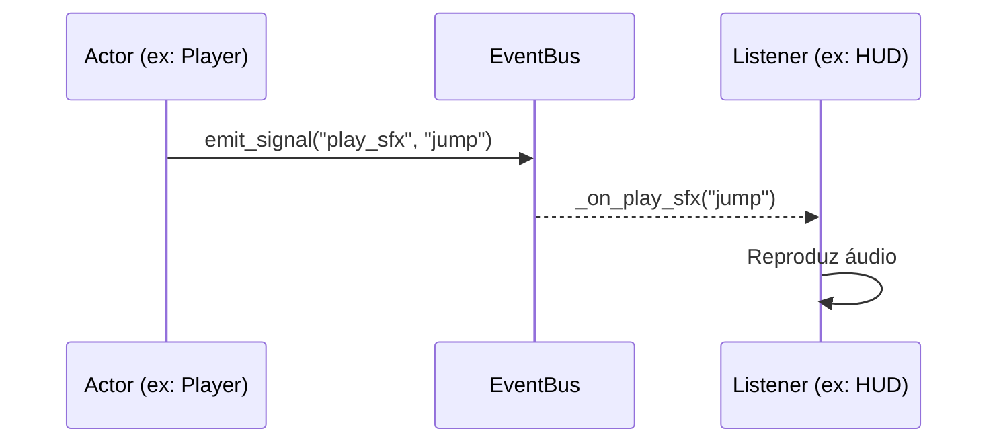

# 📡 EventBus (Observer Pattern)

O `EventBus` é o sistema nervoso central do CodeGame. Ele implementa o padrão de projeto **Observer** (ou Signal Bus) para permitir que nós e sistemas se comuniquem sem ter conhecimento direto uns dos outros.

## Especificações Técnicas

- **Script**: `res://scripts/autoload/EventBus.gd`
- **Tipo**: Singleton (Autoload)

### Principais Sinais e Assinaturas

| Sinal | Parâmetros | Descrição |
|---|---|---|
| `level_started` | `world: int`, `level: int`, `concept: String` | Emitido no `_ready` da `BaseLevel`. |
| `level_completed` | `data: Dictionary` | Emitido quando o jogador atinge o objetivo. |
| `mechanic_activated` | `id: String`, `type: String` | Emitido por qualquer `BaseMechanic`. |
| `variable_changed` | `name: String`, `old: Variant`, `new: Variant` | Emitido quando um `VariableBlock` é alterado. |
| `show_concept_hint` | `concept: String`, `pseudocode: String` | Comanda o HUD para exibir dicas pedagógicas. |

### Fluxo de Comunicação



### Exemplo de Uso (GDScript)
```gdscript
# Emitindo um sinal
EventBus.level_completed.emit({"world": 0, "level": 1})

# Conectando a um sinal
EventBus.show_concept_hint.connect(_on_show_hint)
```

---
[⬅️ Voltar para o README.MD](../../README.md)
