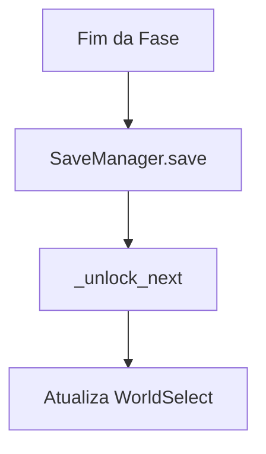

# 🧠 GameState (Singleton Pattern)

O `GameState` é a fonte única de verdade (**Single Source of Truth**) para todos os dados mutáveis durante uma sessão de jogo.

## Especificações Técnicas

- **Script**: `res://scripts/autoload/GameState.gd`
- **Tipo**: Singleton (Autoload)

### Atributos Principais

- `player_uuid`: Identificador único (UUID v4) para telemetria.
- `unlocked_levels`: Dicionário `{ world_id: level_id }` que rastreia a progressão real.
- `current_attempts`: Inteiro que reseta a cada nível; usado para calcular a métrica `understood`.
- `current_decisions`: Array de strings que armazena os nós de escolha visitados pelo jogador.

### Métodos de Destaque

#### `record_decision(decision: String)`
Adiciona uma string ao array `current_decisions`.
> **Uso**: Chamado por triggers em puzzles para rastrear o caminho lógico tomado.

#### `get_elapsed_seconds() -> float`
Calcula o tempo decorrido desde `_level_start_ticks` convertido para segundos.

#### `_unlock_next(world: int, level: int)`
Lógica interna que valida se o próximo nível ou mundo deve ser liberado com base na configuração da cena.

### Lógica de Progressão

---
[⬅️ Voltar para o README.MD](../../README.md)
